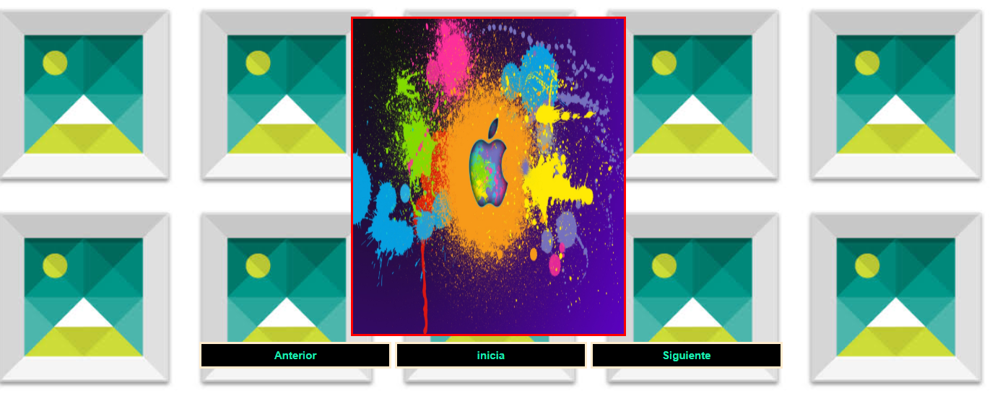
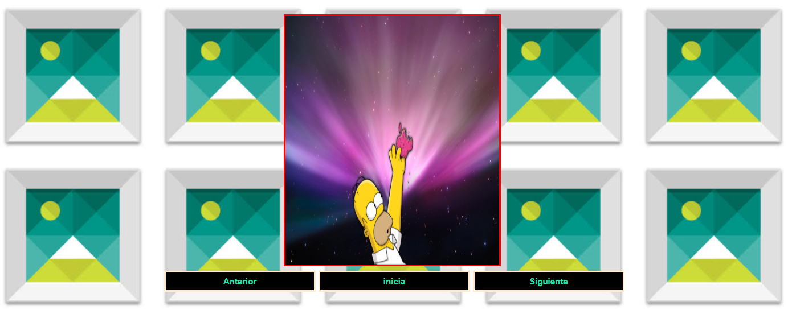
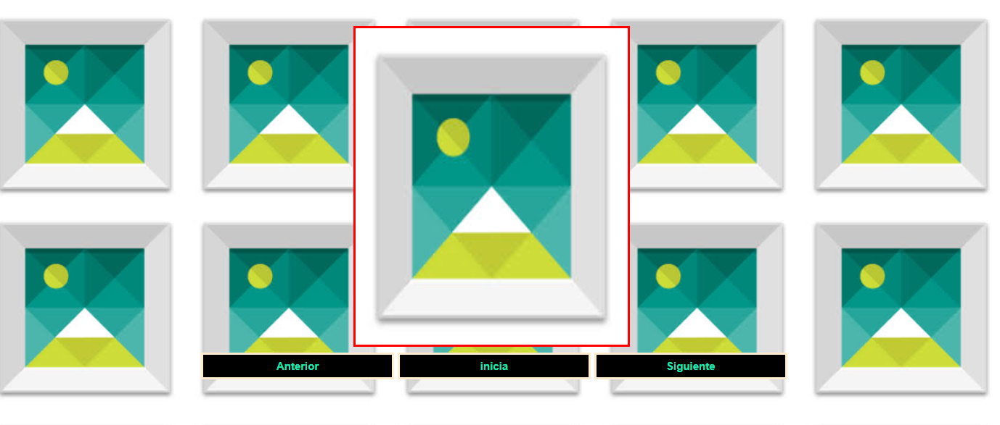

Diseñar una interfaz en html que tenga tres botones que diga “Anterior”, “Iniciar”, “Siguiente”, y una imagen. Luego, desde javascript se debe controlar para al hacer clic sobre uno de los botones realice una acción relacionada a una galería de imágenes
#a. Se debe validar qué, en el campo de la cedula, se ingrese sólo números y que la misma sea correcta, en base, al último dígito verificador.

#b. Se debe tener, un arreglo con los nombres de diez imágenes, previamente descargadas y almacenadas en una carpeta llamada “images”.

#3.La galería de imágenes debe visualizar exclusivamente 5 imágenes.

#5. Al hacer clic en el botón siguiente y haber llegado a la última imagen disponible, el botón siguiente deberá ser deshabilitado (sólo cuando se ha llegado a la última imagen el botón siguiente deberá estar deshabilitado)

#6.Al hacer clic en el botón anterior y haber llegado a la primera imagen disponible, el botón anterior deberá ser deshabilitado (sólo cuando se ha llegado a la última imagen y cuando se inicie la galería de imágenes el botón anterior deberá estar deshabilitado)

=======
#conclusiones

con el presente tarea se puedo analizar toodo lo referente a lo de javascripst con sus funciones y todo lo referente al tema

#recomendacione

se debe investigar  preguntar a su tutor referente a algun tema desconocido por su persona

firma

